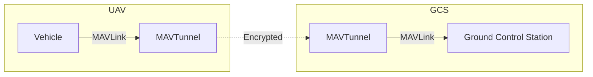

# MAVTunnel

Create a encrypted channel between the ground control stations and the vehicle management computer.

## Design

```mermaid
graph LR
  subgraph UAV
    direction TB
    A[Vehicle] -- MAVLink --> T1[MAVTunnel]
  end
  T1 -. "Encrypted" .-> T2[MAVTunnel]
  subgraph GCS
    direction TB
    T2 -- MAVLink --> G[Ground Control Station]
  end
```
