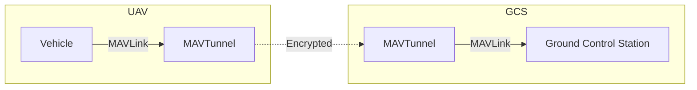

# MAVTunnel

Create a encrypted channel between the ground control stations and the vehicle management computer.

## Design



## Dependencies

```bash
# install latest cmake
wget https://github.com/Kitware/CMake/releases/download/v3.26.4/cmake-3.26.4-linux-<ARCH>.sh
chmod u+x cmake-3.26.4-linux-<ARCH>.sh

sudo ./cmake-3.26.4-linux-<ARCH>.sh --prefix=/usr/local --exclude-subdir
```

```bash
# install gcc and python
sudo apt install gcc python3 python3-pip
```

## Build

```bash
mkdir build
cd build

# configure
cmake ..

# build
make mavtunnel
``` 

## Test

```bash
# mavtunnel for pts devices
make main-pts-loopback
make pts_fork

pts_fork ./uart-sitl ./uart-sitl-tunnel
pts_fork ./uart-gcs ./uart-gcs-tunnel

./tests/main-pts-loopback
```

```bash
# mavtunnel for ttyAMA0 and ttyAMA1
make main-ttyAMA
./tests/main-ttyAMA
```
